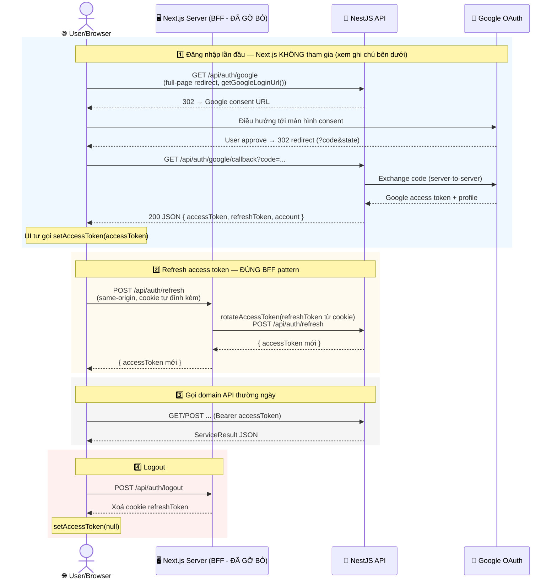

# [SUPERSEDED 2026-07-02] Giao tiếp User/Browser ↔ Next.js Server (BFF) ↔ NestJS API ↔ Google OAuth

> **Sơ đồ dưới đây mô tả kiến trúc BFF tự viết (hand-rolled), đã được implement rồi bị gỡ bỏ.**
> Quyết định cuối cùng (thống nhất trực tiếp với user): session/token lifecycle được giao lại cho
> **NextAuth (Auth.js)**, cấu hình bên trong app Next.js (`apps/*`) tương lai — không còn package
> `auth-service` tự viết trong workspace này. Xem `.specify/memory/constitution.md` v2.0.0
> Principle VI và `specs/001-domain-service-layer/research.md` §5 để biết chi tiết quyết định và lý
> do. File này được giữ lại làm tài liệu lịch sử, không phản ánh kiến trúc hiện tại.

## Vì sao đổi hướng

- Cơ chế BFF tự viết (Route Handler tự set cookie httpOnly, tự quản lý refresh/logout) đã hoạt
  động đúng và tuân thủ constitution v1.2.0 — nhưng trùng lặp chức năng NextAuth đã cung cấp sẵn
  (session cookie mã hoá, refresh-rotation callback, CSRF handling).
- NextAuth **không** thay thế luồng OAuth thật với Google — backend (NestJS) vẫn tự làm toàn bộ
  OAuth exchange và tự phát hành JWT riêng. NextAuth chỉ đóng vai trò quản lý session/cookie cho
  các JWT đó, thông qua `Credentials` provider bọc lại luồng của backend — không dùng NextAuth's
  Google provider độc lập.
- Câu hỏi kiến trúc cốt lõi ("accessToken có lộ ra client hay không") **không biến mất** khi dùng
  NextAuth — nó chỉ chuyển thành 1 lựa chọn cấu hình trong `session` callback của NextAuth, xem
  constitution v2.0.0 Principle VI để biết rule cụ thể.

## Sơ đồ lịch sử (kiến trúc đã gỡ bỏ)

## Bước tiếp theo (khi có `apps/*`)

Cấu hình NextAuth với `Credentials` provider gọi sang backend, quyết định `session` callback có
expose `accessToken` cho client hay không (xem trade-off ở constitution v2.0.0 Principle VI), và
wire `getAccessToken`/`onUnauthenticated` từ NextAuth vào `configure*Service` của từng domain
package (`account-service`, `profiles-service`, `admin-service`, `caro-service`) — xem
[README.md](README.md#wiring-session-state).
